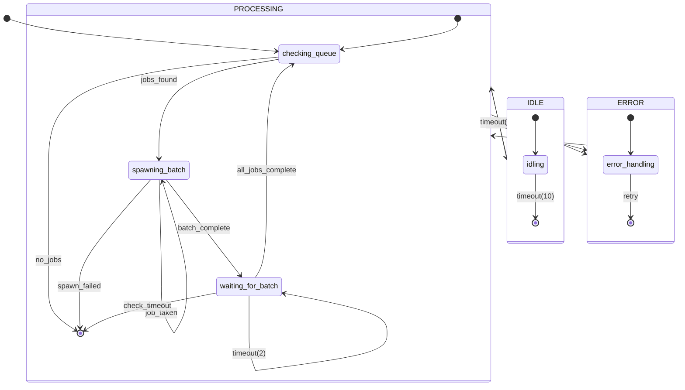

# concurrent-controller

**Description:** 

**Generated from:** `concurrent-controller.yaml`
**Machine Name:** `unknown`
**Version:** `unknown`
**Job Type:** `unknown`

---

## Main State Machine Flow

---

## States Overview

| State | Description | Key Actions |
|-------|-------------|-------------|
| `checking_queue` | Checking Queue | log, set_context, get_pending_jobs |
| `spawning_batch` | Spawning Batch | pop_from_list, log, claim_job |
| `waiting_for_batch` | Waiting For Batch | log, wait_for_jobs, log |
| `idling` | Idling | log |
| `error_handling` | Error Handling | log, bash |

---

## Events Overview

| Event | Type | Description |
|-------|------|-------------|
| `jobs_found` | Job | Jobs Found |
| `no_jobs` | Job | No Jobs |
| `has_job` | Job | Has Job |
| `worker_spawned` | Internal | Worker Spawned |
| `batch_complete` | Internal | Batch Complete |
| `job_claimed` | Job | Job Claimed |
| `spawn_failed` | Error | Spawn Failed |
| `job_taken` | Job | Job Taken |
| `all_jobs_complete` | Job | All Jobs Complete |
| `check_timeout` | Internal | Check Timeout |
| `retry` | Internal | Retry |
| `timeout(2)` | Internal | Timeout(2) |
| `timeout(10)` | Internal | Timeout(10) |

---

## Configuration Summary

- **States:** 5
- **Events:** 13
- **Transitions:** 11
- **Initial State:** `checking_queue`

---

*Generated by yaml_to_fsm.py*