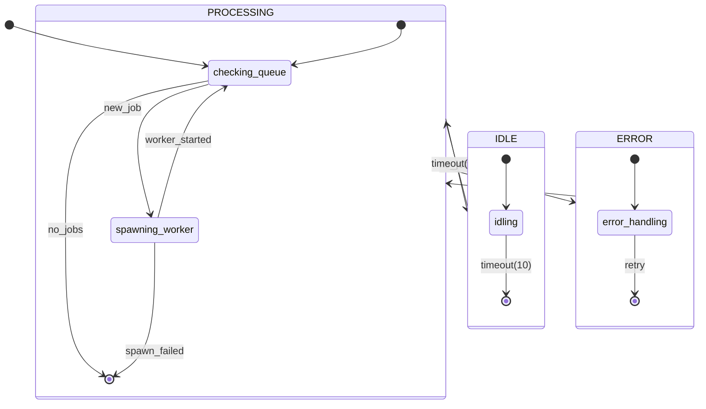

# concurrent-controller

**Description:** 

**Generated from:** `concurrent-controller.yaml`
**Machine Name:** `unknown`
**Version:** `unknown`
**Job Type:** `unknown`

---

## Main State Machine Flow

---

## States Overview

| State | Description | Key Actions |
|-------|-------------|-------------|
| `checking_queue` | Checking Queue | log, check_database_queue |
| `spawning_worker` | Spawning Worker | log, start_fsm, log |
| `idling` | Idling | log |
| `error_handling` | Error Handling | log, bash |

---

## Events Overview

| Event | Type | Description |
|-------|------|-------------|
| `new_job` | Job | New Job |
| `no_jobs` | Job | No Jobs |
| `worker_started` | Internal | Worker Started |
| `spawn_failed` | Error | Spawn Failed |
| `retry` | Internal | Retry |
| `timeout(10)` | Internal | Timeout(10) |

---

## Configuration Summary

- **States:** 4
- **Events:** 6
- **Transitions:** 6
- **Initial State:** `checking_queue`

---

*Generated by yaml_to_fsm.py*