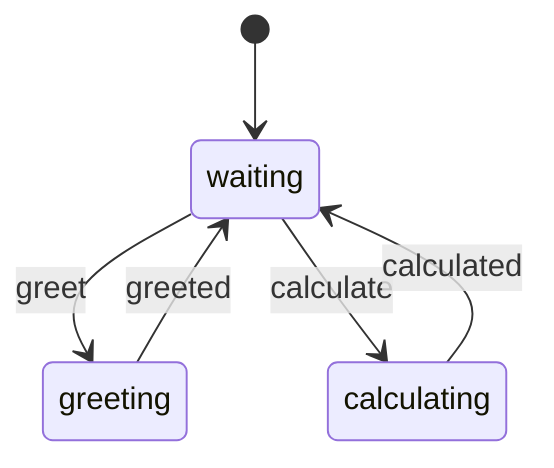
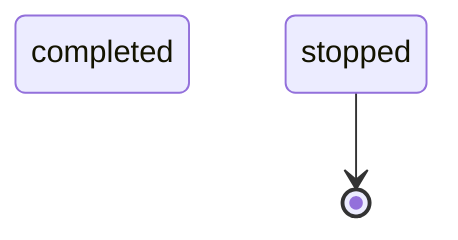

# State Machine

**Description:** 

**Generated from:** `worker.yaml`
**Machine Name:** `custom_worker`
**Version:** `unknown`
**Job Type:** `unknown`

---

## Main State Machine Flow

---

## Stop/Shutdown Flow

---

## Configuration Summary

- **States:** 0
- **Events:** 0
- **Transitions:** 5
- **Initial State:** `waiting`

---

*Generated by yaml_to_fsm.py*