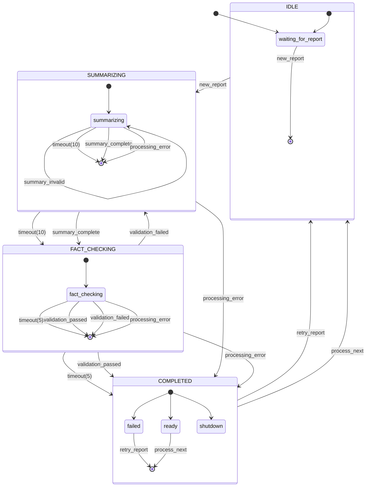
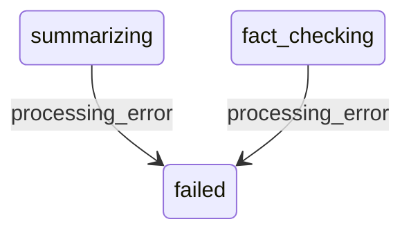
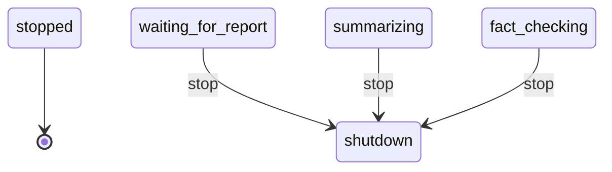

# patient_records

**Description:** 

**Generated from:** `patient-records.yaml`
**Machine Name:** `unknown`
**Version:** `unknown`
**Job Type:** `unknown`

---

## Main State Machine Flow

---

## Error Handling Flow

---

## Stop/Shutdown Flow

---

## States Overview

| State | Description | Key Actions |
|-------|-------------|-------------|
| `waiting_for_report` | Waiting For Report | log |
| `summarizing` | Summarizing | log, log |
| `fact_checking` | Fact Checking | log, log |
| `ready` | Ready | log, bash |
| `failed` | Failed | log |
| `shutdown` | Shutdown | log |

---

## Events Overview

| Event | Type | Description |
|-------|------|-------------|
| `new_report` | Internal | New Report |
| `summary_complete` | Internal | Summary Complete |
| `summary_invalid` | Internal | Summary Invalid |
| `validation_passed` | Internal | Validation Passed |
| `validation_failed` | Error | Validation Failed |
| `processing_error` | Internal | Processing Error |
| `retry_report` | Internal | Retry Report |
| `process_next` | Internal | Process Next |
| `stop` | Control | Stop |

---

## Configuration Summary

- **States:** 6
- **Events:** 9
- **Transitions:** 12
- **Initial State:** `waiting_for_report`

---

*Generated by yaml_to_fsm.py*