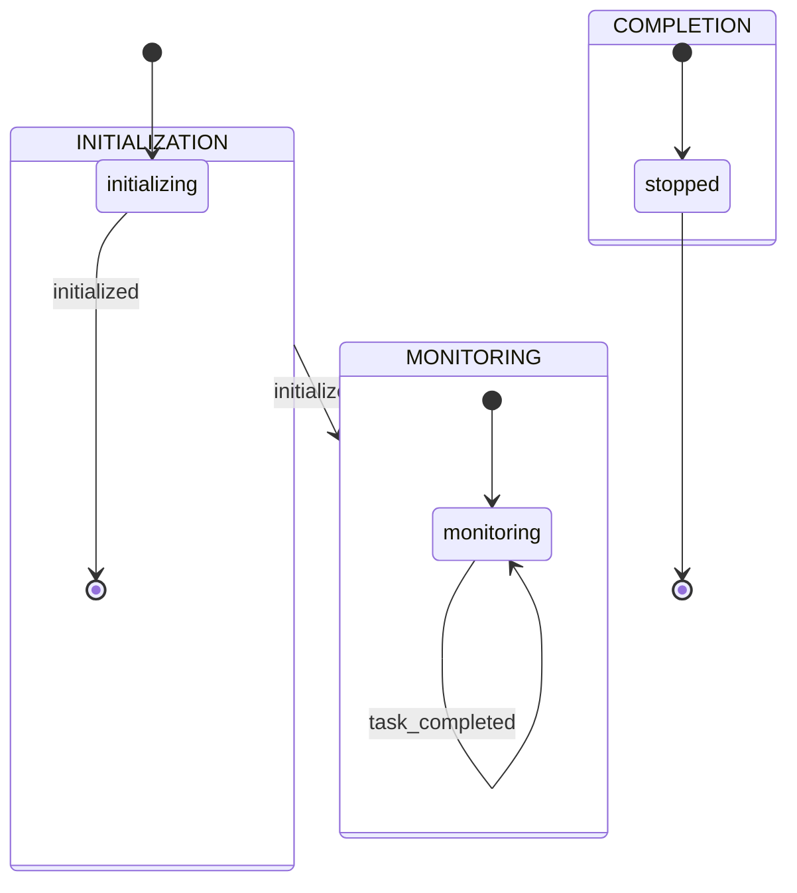
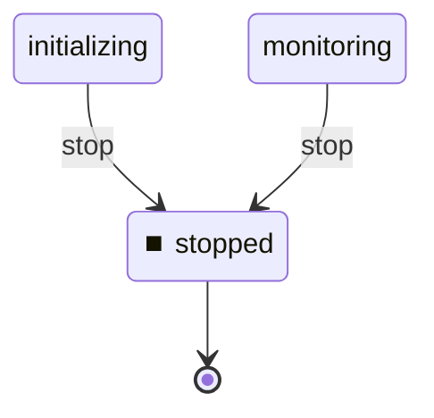

# Task Controller Machine

**Description:** Event monitoring and coordination for multi-machine workflows

**Generated from:** `controller.yaml`
**Machine Name:** `task_controller`
**Version:** `1.0.0`
**Job Type:** `monitoring`

---

## Main State Machine Flow

---

## Stop/Shutdown Flow

---

## States Overview

| State | Description | Key Actions |
|-------|-------------|-------------|
| `initializing` | Initializing | log, bash |
| `monitoring` | Monitoring | log, check_events, bash |
| `stopped` | Stopped | log |

---

## Events Overview

| Event | Type | Description |
|-------|------|-------------|
| `initialized` | Internal | Initialized |
| `task_completed` | Success | Task Completed |
| `no_events` | Internal | No Events |
| `stop` | Control | Stop |

---

## Configuration Summary

- **States:** 3
- **Events:** 4
- **Transitions:** 4
- **Initial State:** `initializing`

---

*Generated by yaml_to_fsm.py*