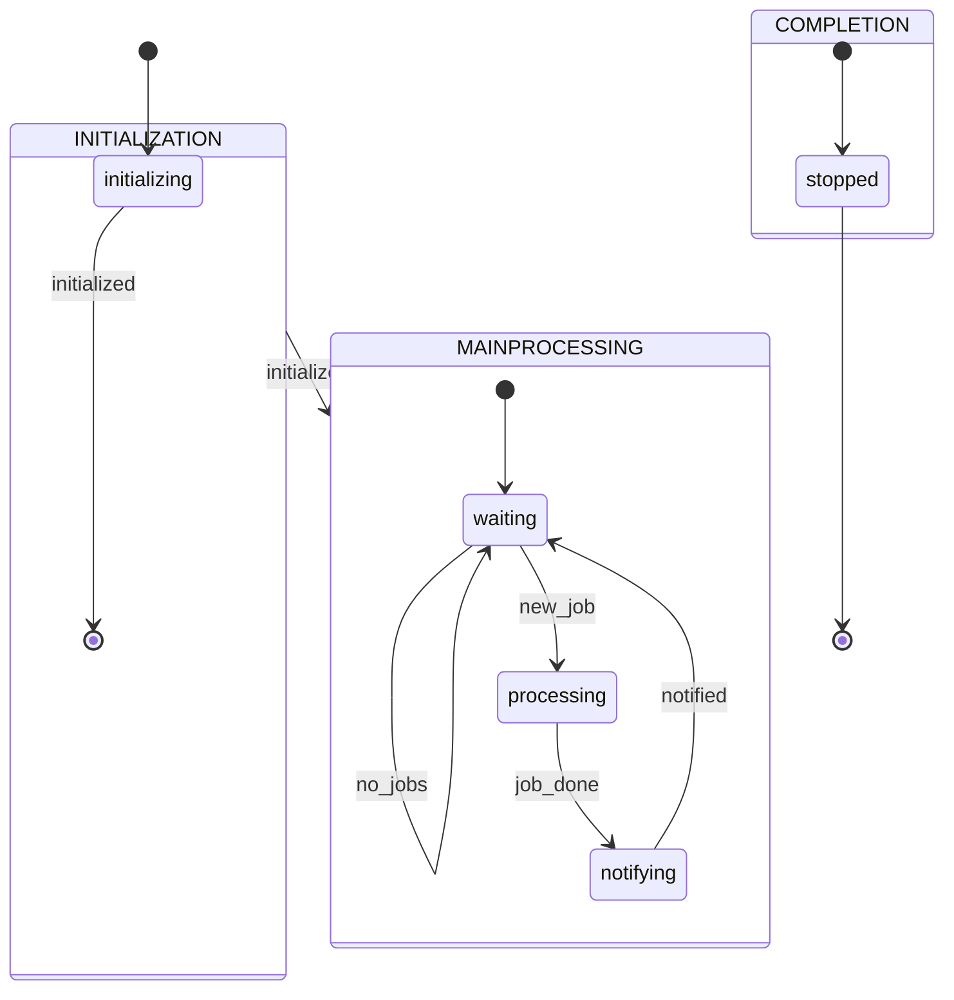
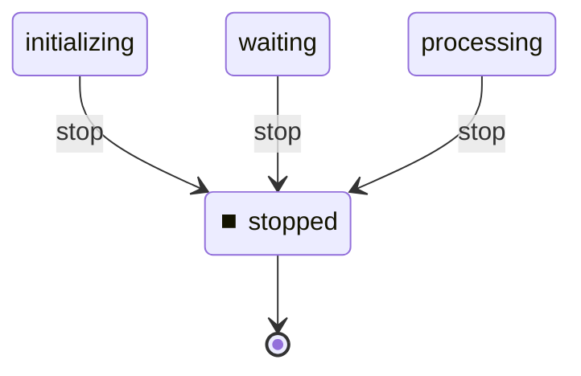

# Task Worker Machine

**Description:** Job processing with controller notification

**Generated from:** `worker.yaml`
**Machine Name:** `task_worker`
**Version:** `1.0.0`
**Job Type:** `task`

---

## Main State Machine Flow

---

## Stop/Shutdown Flow

---

## States Overview

| State | Description | Key Actions |
|-------|-------------|-------------|
| `initializing` | Initializing | log, bash |
| `waiting` | Waiting | log, check_database_queue |
| `processing` | Processing | log, bash |
| `notifying` | Notifying | log, send_event, bash |
| `stopped` | Stopped | log |

---

## Events Overview

| Event | Type | Description |
|-------|------|-------------|
| `initialized` | Internal | Initialized |
| `new_job` | Job | New Job |
| `no_jobs` | Job | No Jobs |
| `job_done` | Success | Job Done |
| `notified` | Internal | Notified |
| `stop` | Control | Stop |

---

## Configuration Summary

- **States:** 5
- **Events:** 6
- **Transitions:** 6
- **Initial State:** `initializing`

---

*Generated by yaml_to_fsm.py*