# Plan: CSS-Only Updates for Flicker-Free Diagram Animation (Simplified)

**Document Type:** Implementation Plan  
**Created:** 2025-10-26  
**Status:** Planning  
**Priority:** High  
**Estimated Effort:** 4-6 hours  

## Overview

Eliminate diagram flicker by parsing SVG once after Mermaid render, enriching it with data attributes, then using simple CSS class updates for state changes.

**Current Problem:**
- Every state change triggers full Mermaid re-render (~100-150ms)
- Visible flicker during DOM destruction and SVG regeneration (~80ms)

**Simplified Solution:**
1. Render diagram with Mermaid (once per structure change)
2. Parse SVG once, add `data-state-id` and `data-edge-event` attributes
3. Cache the enriched SVG
4. State changes: simple `querySelector('[data-state-id="X"]')` + CSS class toggle
5. No version hashing, no complex cache logic

**Expected Outcome:**
- ✅ Zero flicker for state changes
- ✅ Instant updates (~1ms)
- ✅ Simple code (~60 lines total)
- ✅ Easy debugging (data attributes in DevTools)

## Architecture Diagram

```mermaid
flowchart TD
    A[State Change Event] --> B[updateState called]
    
    B --> C{Is SVG enriched?}
    
    C -->|Yes| D[🚀 FAST PATH]
    C -->|No| E[🐌 SLOW PATH: First render]
    
    D --> F[querySelector data-state-id]
    F --> G[Remove .active from all]
    G --> H[Add .active to new state]
    H --> I[querySelector data-edge-event]
    I --> J[Add .last-transition-arrow]
    J --> K[✅ Done: 1ms]
    
    E --> L[Mermaid.run - render SVG]
    L --> M[enrichSvgWithDataAttributes]
    M --> N[Find all state nodes]
    N --> O[Add data-state-id to each]
    O --> P[Find all edge labels]
    P --> Q[Add data-edge-event to paths]
    Q --> R[Mark as enriched]
    R --> S[✅ Done: 100ms]
    
    style D fill:#90EE90,stroke:#006400,stroke-width:3px
    style K fill:#90EE90,stroke:#006400,stroke-width:3px
    style E fill:#FFD700,stroke:#FF8C00,stroke-width:2px
    style S fill:#FFD700,stroke:#FF8C00,stroke-width:2px
```



## Process Flow


## Key Simplifications

### 1. No Version Hashing
- Don't hash diagram code to detect changes
- Simply: if Mermaid renders, enrich SVG
- If enriched SVG exists, use it

### 2. No Complex Cache Map
- Single flag: `this.svgEnriched = false`
- Enrich after every Mermaid render
- Update logic checks DOM directly

### 3. Parse Once, Update Many
- SVG parsing happens once per render
- All state changes use data attributes
- No repeated querySelector searches

### 4. Data Attributes for Easy Selection
- `data-state-id="state_name"` - Direct state selection
- `data-edge-event="event_name"` - Direct edge selection
- No complex ID matching patterns

## Implementation Tasks

### Phase 1: SVG Enrichment (2 hours)

- [ ] **Task 1.1:** Add `enrichSvgWithDataAttributes()` method
  - Called once after Mermaid.run() completes
  - Returns void (modifies SVG in-place)

- [ ] **Task 1.2:** Enrich state nodes with data-state-id
  - Find all SVG nodes matching state pattern
  - Extract state name from node ID or text content
  - Add `dataset.stateId = stateName`

- [ ] **Task 1.3:** Enrich edge paths with data-edge-event
  - Find all edge label elements (g.edgeLabels g.label)
  - Extract event name from label text
  - Find corresponding path by data-id
  - Add `dataset.edgeEvent = eventName` to path

- [ ] **Task 1.4:** Mark container as enriched
  - Add `data-enriched="true"` to container
  - Simple check: `this.container.dataset.enriched === 'true'`

### Phase 2: Simplified Update Logic (1.5 hours)

- [ ] **Task 2.1:** Add `updateStateHighlight(stateName)` method
  - Simple method with one parameter
  - No cache checks, no version checks
  - Just DOM manipulation

- [ ] **Task 2.2:** Remove old highlights
  - `querySelectorAll('.active, .activeComposite')`
  - `forEach(el => el.classList.remove(...))`

- [ ] **Task 2.3:** Add new highlight using data attribute
  - `querySelector('[data-state-id="${stateName}"]')`
  - `if (node) node.classList.add('active')`

- [ ] **Task 2.4:** Highlight transition arrow using data attribute
  - `querySelector('[data-edge-event="${eventName}"]')`
  - `if (edge) edge.classList.add('last-transition-arrow')`
  - Keep existing timeout cleanup

### Phase 3: Integration (1 hour)

- [ ] **Task 3.1:** Update `renderDiagram()` to call enrichment
  - After `mermaid.run()` succeeds
  - Call `enrichSvgWithDataAttributes()`
  - No other changes needed

- [ ] **Task 3.2:** Update `updateState()` to check if enriched
  - If `this.container.dataset.enriched === 'true'`
  - Call `updateStateHighlight()` and return early
  - Else fall back to `renderDiagram()`

- [ ] **Task 3.3:** Handle diagram structure changes
  - When new diagram loaded, enriched flag is cleared
  - Natural re-enrichment on next render
  - No manual cache invalidation needed

### Phase 4: Testing (1 hour)

- [ ] **Task 4.1:** Test state change after first render
  - Load diagram, verify enrichment
  - Change state, verify CSS-only update
  - Check data attributes in DevTools

- [ ] **Task 4.2:** Test rapid state changes
  - 10 state changes in quick succession
  - All should be CSS-only (~1ms each)
  - No flicker visible

- [ ] **Task 4.3:** Test composite state navigation
  - Navigate to subdiagram (new enrichment)
  - Change state in subdiagram (CSS-only)
  - Navigate back to main (new enrichment)

- [ ] **Task 4.4:** Test edge cases
  - State not found (graceful fallback)
  - Edge not found (no error, just no highlight)
  - Browser refresh (re-enrichment)

### Phase 5: Documentation (0.5 hours)

- [ ] **Task 5.1:** Add inline comments
  - Document enrichSvgWithDataAttributes()
  - Explain data attribute strategy
  - Note why this is simpler than caching

- [ ] **Task 5.2:** Update console logging
  - Log "SVG enriched with data attributes"
  - Log "CSS-only update" for fast path
  - Log "Full render" for slow path

- [ ] **Task 5.3:** Add debugging helper
  - `window.checkSvgEnrichment()` - shows all data attributes
  - `window.forceReEnrich()` - re-runs enrichment

## Implementation Code

### Core Enrichment Logic

```javascript
enrichSvgWithDataAttributes() {
    const svg = this.container.querySelector('svg');
    if (!svg) {
        console.warn('[Enrich] No SVG found');
        return;
    }
    
    let enrichedCount = 0;
    
    // 1. Enrich state nodes
    const stateNodes = svg.querySelectorAll('g.node');
    stateNodes.forEach(node => {
        // Extract state name from node ID or text
        const nodeId = node.id || '';
        const textEl = node.querySelector('text');
        const stateName = textEl ? textEl.textContent.trim() : 
                         nodeId.replace(/^flowchart-/, '').replace(/-\d+$/, '');
        
        if (stateName) {
            node.dataset.stateId = stateName;
            enrichedCount++;
        }
    });
    
    // 2. Enrich edge paths
    const edgeLabels = svg.querySelectorAll('g.edgeLabels g.label');
    edgeLabels.forEach(label => {
        const eventName = label.textContent.trim();
        const dataId = label.dataset.id;
        
        if (eventName && dataId) {
            const path = svg.querySelector(`path[data-id="${dataId}"]`);
            if (path) {
                path.dataset.edgeEvent = eventName;
                enrichedCount++;
            }
        }
    });
    
    // 3. Mark as enriched
    this.container.dataset.enriched = 'true';
    console.log(`[Enrich] Added data attributes to ${enrichedCount} elements`);
}
```

### Simple Update Logic

```javascript
updateStateHighlight(stateName, eventName = null) {
    const svg = this.container.querySelector('svg');
    if (!svg) return;
    
    // Remove old highlights
    svg.querySelectorAll('.active, .activeComposite').forEach(el => {
        el.classList.remove('active', 'activeComposite');
    });
    
    // Add new highlight
    const stateNode = svg.querySelector(`[data-state-id="${stateName}"]`);
    if (stateNode) {
        stateNode.classList.add('active');
        console.log(`[CSS-only] Highlighted state: ${stateName}`);
    }
    
    // Highlight transition arrow
    if (eventName) {
        // Clear old arrow highlights
        svg.querySelectorAll('.last-transition-arrow').forEach(el => {
            el.classList.remove('last-transition-arrow');
        });
        
        const edge = svg.querySelector(`[data-edge-event="${eventName}"]`);
        if (edge) {
            edge.classList.add('last-transition-arrow');
            
            // Auto-clear after 2 seconds
            setTimeout(() => {
                edge.classList.remove('last-transition-arrow');
            }, 2000);
        }
    }
}
```

### Integration into renderDiagram()

```javascript
async renderDiagram(highlightState = null, transition = null) {
    // Check if we can use CSS-only update
    if (this.container.dataset.enriched === 'true' && highlightState) {
        const eventName = transition?.event;
        this.updateStateHighlight(highlightState, eventName);
        return; // FAST PATH - done in ~1ms
    }
    
    // SLOW PATH - full Mermaid render
    if (!this.currentDiagram) return;
    
    try {
        let diagramCode = this.currentDiagram;
        
        // ... existing fade effect logic ...
        this.container.classList.add('redrawing');
        await new Promise(resolve => setTimeout(resolve, 50));
        
        // Render with Mermaid
        this.container.innerHTML = `<pre class="mermaid">${diagramCode}</pre>`;
        const mermaidEl = this.container.querySelector('.mermaid');
        await window.mermaid.run({ nodes: [mermaidEl] });
        
        // ✨ NEW: Enrich SVG after render
        this.enrichSvgWithDataAttributes();
        
        // Remove fade effect
        this.container.classList.remove('redrawing');
        this.container.classList.add('has-diagram');
        
        // Attach handlers
        this.attachCompositeClickHandlers();
        
        // Initial highlight
        if (highlightState) {
            const eventName = transition?.event;
            this.updateStateHighlight(highlightState, eventName);
        }
        
    } catch (error) {
        console.error('Error rendering diagram:', error);
        this.container.dataset.enriched = 'false'; // Clear flag on error
    }
}
```

## Data Attribute Examples

**State Node (before enrichment):**
```html
<g class="node" id="flowchart-processing-123">
    <rect ...></rect>
    <text>processing</text>
</g>
```

**State Node (after enrichment):**
```html
<g class="node" id="flowchart-processing-123" data-state-id="processing">
    <rect ...></rect>
    <text>processing</text>
</g>
```

**Edge Path (before enrichment):**
```html
<path class="edge" data-id="L-waiting-processing-0" d="M..."></path>
```

**Edge Label:**
```html
<g class="label" data-id="L-waiting-processing-0">
    <text>new_job</text>
</g>
```

**Edge Path (after enrichment):**
```html
<path class="edge" data-id="L-waiting-processing-0" data-edge-event="new_job" d="M..."></path>
```

## Why This is Simpler

### Removed Complexity

❌ **No version hashing** - Was 20+ lines of hash logic  
❌ **No cache Map** - Was managing Map entries, LRU eviction  
❌ **No version comparison** - Was comparing hashes every update  
❌ **No cache invalidation** - Was clearing cache on various events  
❌ **No cache size limits** - Was tracking memory usage  

### Added Simplicity

✅ **Single enrichment flag** - Just `dataset.enriched === 'true'`  
✅ **Data attributes** - Browser-native, debuggable in DevTools  
✅ **Parse once** - Only after Mermaid renders  
✅ **Simple selectors** - Direct `[data-state-id="X"]` queries  
✅ **Natural invalidation** - New render = new enrichment  

### Code Comparison

**Before (complex caching):**
- getDiagramVersion(): 15 lines
- Cache management: 30 lines
- Version comparison: 10 lines
- Invalidation logic: 20 lines
- **Total: ~75 lines**

**After (data attributes):**
- enrichSvgWithDataAttributes(): 25 lines
- updateStateHighlight(): 15 lines
- Integration: 5 lines
- **Total: ~45 lines**

**Reduction: 40% less code**

## Performance Expectations

**First Render (or structure change):**
- Mermaid render: 100ms
- SVG enrichment: 5-10ms
- **Total: ~110ms** (10% slower than current, acceptable)

**State Change (enriched SVG):**
- querySelector: <1ms
- Class toggle: <1ms
- **Total: ~1ms** (100x faster than current)

**10 State Changes:**
- Before: 1000-1500ms (10 × 100-150ms)
- After: ~110ms first + 9×1ms = ~119ms
- **Speedup: 8-12x for typical usage**

## Testing Checklist

- [ ] First render enriches SVG with data attributes
- [ ] State change uses CSS-only update (check console log)
- [ ] 10 rapid state changes all use CSS-only
- [ ] Arrow highlighting works with data-edge-event
- [ ] Composite navigation re-enriches new diagram
- [ ] Breadcrumb navigation re-enriches when returning
- [ ] State not found doesn't break (graceful fallback)
- [ ] Event not found doesn't break (no arrow highlight)
- [ ] Browser refresh re-enriches on first render
- [ ] DevTools shows data-state-id attributes on nodes
- [ ] DevTools shows data-edge-event attributes on paths

## Success Criteria

**Must Have:**
- ✅ Zero flicker for state changes after first render
- ✅ <2ms update time for CSS-only path
- ✅ Data attributes visible in DevTools
- ✅ No regressions in arrow highlighting
- ✅ Code is simpler than current implementation

**Deal Breakers:**
- ❌ First render significantly slower (>120ms)
- ❌ Enrichment fails on complex diagrams
- ❌ Data attributes don't match state names

## Timeline

**Optimistic:** 3-4 hours  
**Realistic:** 4-6 hours  
**Pessimistic:** 6-8 hours  

**Single Session Approach:**
1. Hour 1: Implement enrichment (Tasks 1.1-1.4)
2. Hour 2: Implement update logic (Tasks 2.1-2.4)
3. Hour 3: Integration (Tasks 3.1-3.3)
4. Hour 4: Testing + debugging (Tasks 4.1-4.4)
5. Hour 5: Documentation (Task 5.1-5.3)

## Rollback Plan

**If enrichment fails:**
- Check `dataset.enriched === 'true'` will be false
- Falls back to full render automatically
- No worse than current behavior

**To disable entirely:**
```javascript
// At top of renderDiagram()
const ENABLE_CSS_ONLY_UPDATES = false; // Toggle here
if (!ENABLE_CSS_ONLY_UPDATES) {
    this.container.dataset.enriched = 'false';
}
```

## References

- **Parent Document:** `docs/ui-animation-implementation.md`
- **Related Issue:** Diagram flicker during repaint
- **Alternative Approach:** Double-buffering (simpler but less optimal)

---

**Status:** 📋 Ready for implementation  
**Complexity:** Low (simple DOM manipulation)  
**Risk:** Low (graceful fallback to current behavior)  
**Last Updated:** 2025-10-26
