# Replan: CSS-Only Updates with Complete Feature Parity

**Document Type:** Implementation Replan (Post v1.0.41 Analysis)  
**Created:** 2025-10-26  
**Status:** Planning - Learned from v1.0.33-40 Failures  
**Priority:** Medium (Optimization, not critical)  
**Estimated Effort:** 12-16 hours (conservative, with testing)  

## Executive Summary

**Goal:** Implement CSS-only state updates (~1ms) while maintaining ALL v1.0.30/v1.0.41 features:
- ✅ Composite state highlighting on main diagram
- ✅ Individual state highlighting on subdiagrams
- ✅ Transition arrow animation
- ✅ State persistence across reloads
- ✅ Diagram switching
- ✅ Breadcrumb navigation

**Key Innovation:** Use metadata as source of truth, not SVG structure
- Metadata tells us what to highlight (composite vs state)
- SVG enrichment makes DOM queries fast
- Fallback to full render handles edge cases

**Success Criteria:**
- Zero regressions from v1.0.41 functionality
- 95%+ of updates use CSS-only path (<5ms)
- Automatic fallback works reliably
- Composite states work correctly 100% of the time

## Lessons from v1.0.33-40 Failures

### What Went Wrong

**1. No Clear Decision Logic**
```javascript
// v1.0.38-40: Tried to detect IF state needs composite mapping
if (compositeName === 'main') continue;
if (compositeData.states.includes(stateName)) {
    // Complex logic here...
}
```
**Problem:** Decision made DURING update → complexity, bugs

**2. SVG-First Approach**
```javascript
// v1.0.33-37: Trusted SVG structure
let stateNode = svg.querySelector(`[data-state-id="${stateName}"]`);
```
**Problem:** SVG IDs inconsistent (state- prefix), fragile

**3. No Metadata Validation**
```javascript
// v1.0.38-40: Assumed metadata exists
for (const [compositeName, compositeData] of Object.entries(this.diagramMetadata.diagrams))
```
**Problem:** Missing metadata → crashes, undefined errors

### What We Should Have Done

**Metadata-First Approach:**
1. Load metadata ONCE when diagram loads
2. Pre-compute what to highlight for each possible state
3. Store mapping: `stateToHighlight = { "monitoring_sdxl": "SDXLLIFECYCLE", ... }`
4. On state change: Fast lookup + DOM update
5. No complex logic during hot path

## Architecture: Metadata-Driven CSS Updates

### Core Principle

> **Metadata tells us WHAT to highlight. SVG enrichment makes it FAST.**

```javascript
// ONCE on diagram load: Build lookup table
this.stateHighlightMap = {
    "monitoring_sdxl": { type: "composite", target: "SDXLLIFECYCLE", class: "activeComposite" },
    "completing_sdxl_job": { type: "composite", target: "SDXLLIFECYCLE", class: "activeComposite" },
    "checking_queue": { type: "composite", target: "QUEUEMANAGEMENT", class: "activeComposite" },
    "waiting_idle": { type: "state", target: "waiting_idle", class: "active" },
    // ... for ALL states
};

// EVERY state update: Fast lookup + DOM query
const entry = this.stateHighlightMap[stateName];
const node = svg.querySelector(`[data-state-id="${entry.target}"]`);
node.classList.add(entry.class);
```

### Flow Diagram

```mermaid
flowchart TD
    A[State Change Event] --> B{enriched && mapped?}
    
    B -->|Yes| C[🚀 FAST PATH]
    B -->|No| D[🐌 SLOW PATH: Full render]
    
    C --> E[Lookup in stateHighlightMap]
    E --> F{Entry found?}
    F -->|Yes| G[querySelector target]
    F -->|No| H[Fallback to slow path]
    
    G --> I{Node found?}
    I -->|Yes| J[Add CSS class]
    I -->|No| H
    
    J --> K[Highlight transition arrow]
    K --> L[✅ Done: ~1ms]
    
    D --> M[v1.0.30 full render]
    M --> N[Build stateHighlightMap]
    N --> O[Enrich SVG]
    O --> P[Mark as ready]
    P --> Q[✅ Done: ~150ms]
    
    H --> M
    
    style C fill:#90EE90,stroke:#006400,stroke-width:3px
    style L fill:#90EE90,stroke:#006400,stroke-width:3px
    style D fill:#FFD700,stroke:#FF8C00,stroke-width:2px
    style M fill:#FFD700,stroke:#FF8C00,stroke-width:2px
```



## Implementation Strategy

### Phase 1: Metadata Preprocessing (CRITICAL)

**When:** After every successful Mermaid render
**What:** Build complete lookup table from metadata

```javascript
/**
 * Build state highlight mapping from metadata
 * Called ONCE after each diagram load
 */
buildStateHighlightMap() {
    const map = {};
    
    if (!this.diagramMetadata?.diagrams) {
        console.warn('[Map] No metadata - will use fallback');
        return null;
    }
    
    const currentDiagram = this.diagramMetadata.diagrams[this.currentDiagramName];
    if (!currentDiagram) {
        console.warn(`[Map] No metadata for ${this.currentDiagramName}`);
        return null;
    }
    
    // Main diagram: Map all states to their composites
    if (this.currentDiagramName === 'main') {
        for (const [compositeName, compositeData] of Object.entries(this.diagramMetadata.diagrams)) {
            if (compositeName === 'main') continue;
            
            if (compositeData.states && Array.isArray(compositeData.states)) {
                for (const stateName of compositeData.states) {
                    map[stateName] = {
                        type: 'composite',
                        target: compositeName,
                        class: 'activeComposite',
                        originalState: stateName
                    };
                }
            }
        }
        
        console.log(`[Map] Built mapping for main diagram: ${Object.keys(map).length} states → composites`);
    } 
    // Subdiagram: Direct state mapping
    else {
        if (currentDiagram.states && Array.isArray(currentDiagram.states)) {
            for (const stateName of currentDiagram.states) {
                map[stateName] = {
                    type: 'state',
                    target: stateName,
                    class: 'active',
                    originalState: stateName
                };
            }
            console.log(`[Map] Built mapping for ${this.currentDiagramName}: ${Object.keys(map).length} direct states`);
        }
    }
    
    return map;
}
```

**Benefits:**
- ✅ All decisions made upfront, not during hot path
- ✅ Easy to debug: Just log the map
- ✅ Clear separation: metadata → map → DOM
- ✅ Validation: Can check if map is complete

### Phase 2: SVG Enrichment (Enhanced)

**When:** After Mermaid render, after building map
**What:** Add data attributes for FAST DOM queries

```javascript
/**
 * Enrich SVG with data attributes for fast lookups
 * Uses stateHighlightMap to know what needs enrichment
 */
enrichSvgWithDataAttributes() {
    const svg = this.container.querySelector('svg');
    if (!svg) {
        console.warn('[Enrich] No SVG found');
        return false;
    }
    
    if (!this.stateHighlightMap) {
        console.warn('[Enrich] No state map - skipping enrichment');
        return false;
    }
    
    let enrichedCount = 0;
    const targets = new Set(Object.values(this.stateHighlightMap).map(e => e.target));
    
    // Enrich state nodes
    const stateNodes = svg.querySelectorAll('g.node');
    for (const node of stateNodes) {
        // Extract state name from text (most reliable)
        const textEl = node.querySelector('text');
        let stateName = textEl ? textEl.textContent.trim() : '';
        
        // Fallback: extract from ID
        if (!stateName) {
            const nodeId = node.id || '';
            stateName = nodeId.replace(/^flowchart-/, '')
                              .replace(/^state-/, '')
                              .replace(/-\d+$/, '');
        }
        
        if (stateName && targets.has(stateName)) {
            node.dataset.stateId = stateName;
            enrichedCount++;
        }
    }
    
    // Enrich edges for transition arrows
    const edgeLabels = svg.querySelectorAll('g.edgeLabels g.label');
    for (const label of edgeLabels) {
        const eventName = label.textContent.trim();
        const dataId = label.getAttribute('data-id');
        
        if (eventName && dataId) {
            const path = svg.querySelector(`path[data-id="${dataId}"]`);
            if (path) {
                path.dataset.edgeEvent = eventName;
                enrichedCount++;
            }
        }
    }
    
    console.log(`[Enrich] ✓ Enriched ${enrichedCount} elements`);
    console.log(`[Enrich] Expected ${targets.size} state nodes + edges`);
    
    // Validate: Did we enrich all expected targets?
    const enrichedStates = new Set(
        Array.from(svg.querySelectorAll('[data-state-id]'))
             .map(n => n.dataset.stateId)
    );
    
    const missingStates = Array.from(targets).filter(t => !enrichedStates.has(t));
    if (missingStates.length > 0) {
        console.warn(`[Enrich] Missing states in SVG:`, missingStates);
        console.warn(`[Enrich] These states won't use fast path`);
    }
    
    return enrichedCount > 0;
}
```

**Benefits:**
- ✅ Validates enrichment against expected states
- ✅ Warns about missing states
- ✅ Text-based extraction (most reliable)
- ✅ Returns success/failure boolean

### Phase 3: CSS-Only Update (Simplified)

**When:** Every state change
**What:** Fast lookup + DOM update

```javascript
/**
 * Update state highlight using CSS-only approach
 * Fast path: ~1ms when map and enrichment ready
 */
updateStateHighlight(stateName, eventName = null) {
    const svg = this.container.querySelector('svg');
    if (!svg) {
        console.warn('[CSS-only] No SVG');
        return false;
    }
    
    // Check if we can use fast path
    if (!this.stateHighlightMap) {
        console.warn('[CSS-only] No state map - fallback');
        return false;
    }
    
    if (this.container.dataset.enriched !== 'true') {
        console.warn('[CSS-only] SVG not enriched - fallback');
        return false;
    }
    
    // Remove old highlights
    svg.querySelectorAll('.active, .activeComposite').forEach(el => {
        el.classList.remove('active', 'activeComposite');
    });
    
    // Lookup what to highlight
    const entry = this.stateHighlightMap[stateName];
    if (!entry) {
        console.warn(`[CSS-only] State "${stateName}" not in map - fallback`);
        console.log('[CSS-only] Available states:', Object.keys(this.stateHighlightMap).slice(0, 5), '...');
        return false;
    }
    
    // Find DOM node
    const node = svg.querySelector(`[data-state-id="${entry.target}"]`);
    if (!node) {
        console.warn(`[CSS-only] Node not found for "${entry.target}" - fallback`);
        return false;
    }
    
    // Apply highlighting
    node.classList.add(entry.class);
    
    if (entry.type === 'composite') {
        console.log(`[CSS-only] ✓ Highlighted composite: ${entry.target} (contains ${entry.originalState}) (~1ms)`);
    } else {
        console.log(`[CSS-only] ✓ Highlighted state: ${entry.target} (~1ms)`);
    }
    
    // Highlight transition arrow
    if (eventName) {
        this.highlightTransitionArrow(svg, eventName);
    }
    
    return true;  // Success!
}

/**
 * Highlight transition arrow by event name
 */
highlightTransitionArrow(svg, eventName) {
    // Clear old arrows
    svg.querySelectorAll('.last-transition-arrow').forEach(el => {
        el.classList.remove('last-transition-arrow');
    });
    
    // Find edge by event name
    const edge = svg.querySelector(`[data-edge-event="${eventName}"]`);
    if (edge) {
        edge.classList.add('last-transition-arrow');
        console.log(`[CSS-only] ✓ Highlighted arrow: ${eventName}`);
        
        // Auto-clear after 2 seconds
        setTimeout(() => {
            edge.classList.remove('last-transition-arrow');
        }, 2000);
    } else {
        console.log(`[CSS-only] Arrow not found for event: ${eventName}`);
    }
}
```

**Benefits:**
- ✅ Simple logic: lookup → find → highlight
- ✅ Clear failure points with warnings
- ✅ Returns boolean for caller to decide
- ✅ All v1.0.30 features included (arrows, composites)

### Phase 4: Render Orchestration (Smart Path Selection)

**When:** Every state change
**What:** Decide fast path vs slow path

```javascript
/**
 * Main render method - decides fast vs slow path
 */
async renderDiagram(highlightState = null, transition = null) {
    // Attempt fast path (CSS-only)
    if (highlightState) {
        const success = this.updateStateHighlight(highlightState, transition?.event);
        if (success) {
            console.log(`[Render] ✓ Fast path success (~1ms)`);
            return;
        }
        console.log(`[Render] Fast path failed, using slow path`);
    }
    
    // Slow path: Full Mermaid render (v1.0.30 approach)
    await this.fullMermaidRender(highlightState, transition);
}

/**
 * Full Mermaid render with metadata preprocessing
 */
async fullMermaidRender(highlightState = null, transition = null) {
    if (!this.currentDiagram) return;
    
    try {
        // Build diagram code with highlighting (v1.0.30 approach)
        let diagramCode = this.currentDiagram;
        let compositeToHighlight = null;
        
        if (highlightState) {
            const isMainDiagram = this.currentDiagramName === 'main';
            
            if (isMainDiagram) {
                // Find composite for state
                compositeToHighlight = await this.findCompositeForState(highlightState);
                if (compositeToHighlight) {
                    diagramCode += `\n\n    classDef activeComposite fill:#FFD700,stroke:#FF8C00,stroke-width:4px`;
                    diagramCode += `\n    class ${compositeToHighlight} activeComposite`;
                }
            } else {
                // Direct state highlighting
                const currentStates = this.diagramMetadata?.diagrams?.[this.currentDiagramName]?.states || [];
                if (currentStates.includes(highlightState)) {
                    diagramCode += `\n\n    classDef active fill:#90EE90,stroke:#006400,stroke-width:4px`;
                    diagramCode += `\n    class ${highlightState} active`;
                }
            }
        }
        
        // Render
        this.container.classList.add('redrawing');
        await new Promise(resolve => setTimeout(resolve, 50));
        
        this.container.innerHTML = `<pre class="mermaid">${diagramCode}</pre>`;
        const mermaidEl = this.container.querySelector('.mermaid');
        await window.mermaid.run({ nodes: [mermaidEl] });
        
        this.container.classList.add('has-diagram');
        this.container.classList.remove('redrawing');
        
        // Build map and enrich for next fast path
        this.stateHighlightMap = this.buildStateHighlightMap();
        
        if (this.stateHighlightMap) {
            const enriched = this.enrichSvgWithDataAttributes();
            if (enriched) {
                this.container.dataset.enriched = 'true';
                console.log('[Render] ✓ Ready for fast path on next update');
            } else {
                console.warn('[Render] Enrichment failed - will use slow path');
                this.container.dataset.enriched = 'false';
            }
        } else {
            console.warn('[Render] Map building failed - will use slow path');
            this.container.dataset.enriched = 'false';
        }
        
        // Attach click handlers
        this.attachCompositeClickHandlers();
        
        // Highlight arrow if needed
        if (transition && transition.from && transition.to) {
            this.highlightTransitionArrowDirect(transition);
        }
        
        console.log('[Render] ✓ Full render complete (~150ms)');
        
    } catch (error) {
        console.error('[Render] Error:', error);
        this.logger.log('error', `Diagram rendering failed: ${error.message}`);
        this.container.classList.remove('redrawing');
        this.container.dataset.enriched = 'false';
    }
}

/**
 * Load diagram - always starts with slow path
 */
async loadDiagram(machineName, diagramName = 'main') {
    try {
        this.selectedMachine = machineName;
        this.logger.log('info', `Loading diagram for ${machineName}/${diagramName}...`);
        
        // Clear fast path state
        this.container.dataset.enriched = 'false';
        this.stateHighlightMap = null;
        
        // Fetch diagram
        let response = await fetch(`/api/diagram/${machineName}/${diagramName}`);
        
        if (response.ok) {
            const data = await response.json();
            this.currentDiagram = data.mermaid_code;
            this.currentDiagramName = diagramName;
            this.diagramMetadata = data.metadata;
            
            this.updateBreadcrumb(machineName, diagramName);
            
            // Load persisted state
            const persistedState = this.loadMachineState(machineName);
            const persistedTransition = this.loadMachineTransition(machineName);
            
            // First render always uses slow path
            await this.fullMermaidRender(persistedState, persistedTransition);
        } else {
            // Fallback to old format
            response = await fetch(`/api/diagram/${machineName}`);
            if (!response.ok) {
                throw new Error(`Failed to load diagram: ${response.statusText}`);
            }
            
            const data = await response.json();
            this.currentDiagram = data.diagram;
            this.currentDiagramName = 'main';
            this.diagramMetadata = null;
            
            const persistedState = this.loadMachineState(machineName);
            const persistedTransition = this.loadMachineTransition(machineName);
            
            await this.fullMermaidRender(persistedState, persistedTransition);
        }
        
        this.logger.log('success', `Diagram loaded for ${machineName}`);
    } catch (error) {
        this.logger.log('error', `Failed to load diagram: ${error.message}`);
        this.container.innerHTML = `
            <div class="error">
                <p>❌ Failed to load diagram</p>
                <p class="error-detail">${error.message}</p>
            </div>
        `;
    }
}
```

**Benefits:**
- ✅ First render: Always slow path (safe)
- ✅ Subsequent renders: Try fast path, fallback automatic
- ✅ Diagram switching: Clears state, starts fresh
- ✅ All v1.0.30 features preserved

## State Management

### Diagram Load Flow


### State Update Flow (Fast Path)

```mermaid
sequenceDiagram
    participant WS as WebSocket
    participant DM as DiagramManager
    participant Map as StateHighlightMap
    participant SVG as SVG DOM
    
    WS->>DM: state_change: monitoring_sdxl
    
    DM->>DM: renderDiagram('monitoring_sdxl')
    
    DM->>DM: updateStateHighlight()
    
    DM->>Map: Lookup 'monitoring_sdxl'
    Map-->>DM: {type:"composite",<br/>target:"SDXLLIFECYCLE",<br/>class:"activeComposite"}
    
    DM->>SVG: Remove .active, .activeComposite
    
    DM->>SVG: querySelector([data-state-id="SDXLLIFECYCLE"])
    SVG-->>DM: <g.node>
    
    DM->>SVG: Add .activeComposite class
    
    DM->>SVG: querySelector([data-edge-event="sdxl_job_done"])
    SVG-->>DM: <path>
    
    DM->>SVG: Add .last-transition-arrow class
    
    Note over DM,SVG: ✅ Update complete: ~1ms
```



### Fallback Flow (Slow Path)

```mermaid
sequenceDiagram
    participant WS as WebSocket
    participant DM as DiagramManager
    participant SVG as SVG DOM
    
    WS->>DM: state_change: unknown_state
    
    DM->>DM: renderDiagram('unknown_state')
    DM->>DM: updateStateHighlight()
    
    alt State not in map
        DM->>DM: Lookup fails
        DM-->>DM: return false
    else Node not in SVG
        DM->>SVG: querySelector fails
        DM-->>DM: return false
    end
    
    Note over DM: Fast path failed
    
    DM->>DM: fullMermaidRender()
    
    Note over DM: Use v1.0.30 approach
    DM->>DM: findCompositeForState()
    DM->>DM: Modify diagram code
    DM->>SVG: Mermaid.run()
    
    DM->>DM: Rebuild map
    DM->>SVG: Re-enrich
    
    Note over DM,SVG: ✅ Update complete: ~150ms<br/>✅ Back on fast path
```



## Testing Strategy

### Unit Tests

```javascript
describe('StateHighlightMap', () => {
    it('should build map for main diagram with composites', () => {
        const metadata = {
            diagrams: {
                main: { composites: ['SDXLLIFECYCLE', 'FACELIFECYCLE'] },
                SDXLLIFECYCLE: { states: ['monitoring_sdxl', 'completing_sdxl'] },
                FACELIFECYCLE: { states: ['monitoring_face', 'completing_face'] }
            }
        };
        
        diagramManager.diagramMetadata = metadata;
        diagramManager.currentDiagramName = 'main';
        
        const map = diagramManager.buildStateHighlightMap();
        
        expect(map['monitoring_sdxl']).toEqual({
            type: 'composite',
            target: 'SDXLLIFECYCLE',
            class: 'activeComposite',
            originalState: 'monitoring_sdxl'
        });
        
        expect(Object.keys(map).length).toBe(4);
    });
    
    it('should build map for subdiagram with direct states', () => {
        const metadata = {
            diagrams: {
                main: { composites: ['SDXLLIFECYCLE'] },
                SDXLLIFECYCLE: { states: ['monitoring_sdxl', 'completing_sdxl'] }
            }
        };
        
        diagramManager.diagramMetadata = metadata;
        diagramManager.currentDiagramName = 'SDXLLIFECYCLE';
        
        const map = diagramManager.buildStateHighlightMap();
        
        expect(map['monitoring_sdxl']).toEqual({
            type: 'state',
            target: 'monitoring_sdxl',
            class: 'active',
            originalState: 'monitoring_sdxl'
        });
    });
    
    it('should return null if metadata missing', () => {
        diagramManager.diagramMetadata = null;
        const map = diagramManager.buildStateHighlightMap();
        expect(map).toBeNull();
    });
});

describe('CSS-Only Update', () => {
    beforeEach(() => {
        // Setup enriched SVG
        document.body.innerHTML = `
            <div id="diagram">
                <svg>
                    <g class="node" data-state-id="SDXLLIFECYCLE"></g>
                    <path data-edge-event="sdxl_job_done"></path>
                </svg>
            </div>
        `;
        
        diagramManager.container = document.getElementById('diagram');
        diagramManager.container.dataset.enriched = 'true';
        
        diagramManager.stateHighlightMap = {
            'monitoring_sdxl': {
                type: 'composite',
                target: 'SDXLLIFECYCLE',
                class: 'activeComposite',
                originalState: 'monitoring_sdxl'
            }
        };
    });
    
    it('should highlight composite using fast path', () => {
        const success = diagramManager.updateStateHighlight('monitoring_sdxl', 'sdxl_job_done');
        
        expect(success).toBe(true);
        
        const composite = document.querySelector('[data-state-id="SDXLLIFECYCLE"]');
        expect(composite.classList.contains('activeComposite')).toBe(true);
        
        const arrow = document.querySelector('[data-edge-event="sdxl_job_done"]');
        expect(arrow.classList.contains('last-transition-arrow')).toBe(true);
    });
    
    it('should return false if state not in map', () => {
        const success = diagramManager.updateStateHighlight('unknown_state');
        expect(success).toBe(false);
    });
    
    it('should return false if SVG not enriched', () => {
        diagramManager.container.dataset.enriched = 'false';
        const success = diagramManager.updateStateHighlight('monitoring_sdxl');
        expect(success).toBe(false);
    });
});

describe('Render Orchestration', () => {
    it('should use fast path on second render', async () => {
        const updateSpy = jest.spyOn(diagramManager, 'updateStateHighlight');
        const fullRenderSpy = jest.spyOn(diagramManager, 'fullMermaidRender');
        
        // First render
        await diagramManager.renderDiagram('monitoring_sdxl');
        expect(fullRenderSpy).toHaveBeenCalled();
        
        // Setup map and enrichment
        diagramManager.stateHighlightMap = { 'monitoring_sdxl': {...} };
        diagramManager.container.dataset.enriched = 'true';
        
        // Second render
        updateSpy.mockReturnValue(true);
        await diagramManager.renderDiagram('completing_sdxl');
        
        expect(updateSpy).toHaveBeenCalledWith('completing_sdxl', undefined);
        expect(fullRenderSpy).toHaveBeenCalledTimes(1); // Not called again
    });
    
    it('should fallback to slow path on fast path failure', async () => {
        const updateSpy = jest.spyOn(diagramManager, 'updateStateHighlight').mockReturnValue(false);
        const fullRenderSpy = jest.spyOn(diagramManager, 'fullMermaidRender');
        
        await diagramManager.renderDiagram('monitoring_sdxl');
        
        expect(updateSpy).toHaveBeenCalled();
        expect(fullRenderSpy).toHaveBeenCalled();
    });
});
```

### Integration Tests

```javascript
describe('End-to-End State Updates', () => {
    it('should handle 10 consecutive state changes', async () => {
        await diagramManager.loadDiagram('controller', 'main');
        
        const states = [
            'checking_queue', 'dispatching_sdxl', 'monitoring_sdxl',
            'completing_sdxl', 'monitoring_face', 'completing_face',
            'notifying_descriptor', 'pipeline_cleanup', 'waiting_idle',
            'checking_queue'
        ];
        
        let fastPathCount = 0;
        let slowPathCount = 0;
        
        for (const state of states) {
            const before = performance.now();
            await diagramManager.renderDiagram(state);
            const duration = performance.now() - before;
            
            if (duration < 10) {
                fastPathCount++;
            } else {
                slowPathCount++;
            }
        }
        
        // First render is slow, rest should be fast
        expect(slowPathCount).toBe(1);
        expect(fastPathCount).toBe(9);
        
        // Verify final state highlighted
        const node = document.querySelector('.activeComposite');
        expect(node).toBeTruthy();
    });
    
    it('should handle diagram switching', async () => {
        // Load main diagram
        await diagramManager.loadDiagram('controller', 'main');
        await diagramManager.renderDiagram('monitoring_sdxl');
        
        // Switch to subdiagram
        await diagramManager.loadDiagram('controller', 'SDXLLIFECYCLE');
        await diagramManager.renderDiagram('monitoring_sdxl');
        
        // Should highlight direct state, not composite
        const state = document.querySelector('.active');
        expect(state.dataset.stateId).toBe('monitoring_sdxl');
        
        const composite = document.querySelector('.activeComposite');
        expect(composite).toBeNull();
    });
});
```

## Performance Targets

### Success Metrics

| Metric | Target | How to Measure |
|--------|--------|----------------|
| Fast path usage | >95% | Count fast path successes vs total updates |
| Fast path latency | <5ms | performance.now() around updateStateHighlight() |
| Slow path latency | <200ms | performance.now() around fullMermaidRender() |
| Map build time | <5ms | performance.now() around buildStateHighlightMap() |
| Enrichment time | <10ms | performance.now() around enrichSvgWithDataAttributes() |
| Zero regressions | 100% | All v1.0.30 features work identically |

### Performance Monitoring

```javascript
class PerformanceMonitor {
    constructor() {
        this.stats = {
            fastPathAttempts: 0,
            fastPathSuccesses: 0,
            fastPathFailures: 0,
            slowPathRenders: 0,
            
            fastPathTimes: [],
            slowPathTimes: [],
            mapBuildTimes: [],
            enrichmentTimes: []
        };
    }
    
    recordFastPath(duration, success) {
        this.stats.fastPathAttempts++;
        if (success) {
            this.stats.fastPathSuccesses++;
            this.stats.fastPathTimes.push(duration);
        } else {
            this.stats.fastPathFailures++;
        }
    }
    
    recordSlowPath(duration) {
        this.stats.slowPathRenders++;
        this.stats.slowPathTimes.push(duration);
    }
    
    getReport() {
        const avg = (arr) => arr.length ? arr.reduce((a,b) => a+b, 0) / arr.length : 0;
        const fastPathRate = this.stats.fastPathAttempts 
            ? (this.stats.fastPathSuccesses / this.stats.fastPathAttempts * 100).toFixed(1)
            : 0;
        
        return {
            fastPathRate: `${fastPathRate}%`,
            avgFastPathTime: `${avg(this.stats.fastPathTimes).toFixed(2)}ms`,
            avgSlowPathTime: `${avg(this.stats.slowPathTimes).toFixed(2)}ms`,
            totalUpdates: this.stats.fastPathAttempts + this.stats.slowPathRenders,
            ...this.stats
        };
    }
}

// Usage
window.diagramPerformance = new PerformanceMonitor();
```

## Implementation Timeline

### Week 1: Foundation (Days 1-5)

**Day 1-2: Metadata Processing**
- [ ] Implement `buildStateHighlightMap()`
- [ ] Unit tests for map building
- [ ] Test with controller.yaml metadata
- [ ] Validate all states mapped correctly

**Day 3-4: SVG Enrichment**
- [ ] Enhance `enrichSvgWithDataAttributes()`
- [ ] Add validation and warnings
- [ ] Test with real SVGs from Mermaid
- [ ] Ensure all expected nodes enriched

**Day 5: Integration**
- [ ] Wire map building into render flow
- [ ] Wire enrichment after map building
- [ ] Test complete pipeline
- [ ] Fix any issues

### Week 2: Fast Path (Days 6-10)

**Day 6-7: CSS-Only Update**
- [ ] Implement `updateStateHighlight()`
- [ ] Handle composites and states
- [ ] Transition arrow highlighting
- [ ] Return success/failure boolean

**Day 8-9: Render Orchestration**
- [ ] Modify `renderDiagram()` for smart routing
- [ ] Ensure `loadDiagram()` clears state
- [ ] Test fallback mechanisms
- [ ] Performance monitoring integration

**Day 10: Testing**
- [ ] Run all unit tests
- [ ] Integration test suite
- [ ] Manual testing with real state machines
- [ ] Performance profiling

### Week 3: Refinement (Days 11-15)

**Day 11-12: Bug Fixes**
- [ ] Address any issues from testing
- [ ] Edge case handling
- [ ] Error message improvements
- [ ] Documentation updates

**Day 13-14: Validation**
- [ ] Test with image-generator-fsm controller
- [ ] Test with simple_worker example
- [ ] Test diagram switching extensively
- [ ] Test state persistence

**Day 15: Documentation & Release**
- [ ] Update DiagramManager header comments
- [ ] Update CHANGELOG.md
- [ ] Create migration guide
- [ ] Release as v1.0.42

### Week 4: Monitoring (Days 16-20)

**Day 16-20: Production Monitoring**
- [ ] Deploy to production
- [ ] Monitor performance metrics
- [ ] Watch for errors/warnings
- [ ] Collect user feedback
- [ ] Make hotfixes if needed

## Risk Mitigation

### Feature Flags

```javascript
const FEATURE_FLAGS = {
    ENABLE_CSS_ONLY_UPDATES: true,     // Master switch
    ENABLE_PERFORMANCE_MONITORING: true, // Collect metrics
    FALLBACK_ON_ANY_ERROR: true,        // Conservative fallback
    LOG_FAST_PATH_DECISIONS: true       // Debug logging
};
```

### Rollback Plan

If critical issues found:

1. **Immediate:** Set `ENABLE_CSS_ONLY_UPDATES = false`
   - Falls back to v1.0.30 approach immediately
   - Zero code changes needed
   - All features continue working

2. **Short-term:** Fix specific issues
   - Update map building logic
   - Fix enrichment validation
   - Improve error handling

3. **Long-term:** Full rollback if unfixable
   - Git revert to v1.0.41
   - Document what went wrong
   - Update plan for future attempts

### Monitoring Alerts

```javascript
// Alert if fast path rate drops below 90%
setInterval(() => {
    const report = window.diagramPerformance.getReport();
    const rate = parseFloat(report.fastPathRate);
    
    if (report.totalUpdates > 20 && rate < 90) {
        console.error('⚠️  ALERT: Fast path rate below 90%:', report);
        // Could send to monitoring service
    }
}, 60000); // Check every minute
```

## Success Criteria

### Must Have (v1.0.42 Release)

- ✅ All v1.0.30 features work identically
- ✅ Composite states highlight correctly 100% of time
- ✅ Fast path used >90% of the time
- ✅ Fast path latency <5ms average
- ✅ Automatic fallback works reliably
- ✅ Zero console errors during normal operation
- ✅ State persistence works across reloads
- ✅ Diagram switching works correctly
- ✅ Transition arrows animate properly

### Nice to Have (Future)

- ⭐ Fast path rate >95%
- ⭐ Performance dashboard in UI
- ⭐ Graceful degradation warnings
- ⭐ Real-time performance metrics
- ⭐ A/B testing framework

## Key Differences from v1.0.33-40

### What's Different

| Aspect | v1.0.33-40 (Failed) | v1.0.42 (This Plan) |
|--------|---------------------|---------------------|
| **Decision timing** | During hot path | Upfront (map building) |
| **Metadata usage** | Ad-hoc lookups | Pre-computed lookup table |
| **SVG structure** | Assumed stable | Validated against map |
| **Fallback** | Unclear, complex | Clear boolean return |
| **Testing** | Minimal | Comprehensive unit + integration |
| **Monitoring** | None | Built-in performance tracking |
| **Validation** | None | Map completeness checked |
| **Error handling** | Warnings | Warnings + automatic fallback |

### Why This Will Succeed

1. **Metadata-First:** All decisions made upfront, not during hot path
2. **Simple Logic:** Lookup → Find → Highlight (3 steps, clear failure points)
3. **Validation:** Map completeness checked, warnings if incomplete
4. **Fallback:** Clear boolean return, automatic slow path on failure
5. **Testing:** Comprehensive unit and integration tests
6. **Monitoring:** Built-in performance tracking
7. **Rollback:** Feature flag allows instant disable

## Conclusion

This replan addresses all failures from v1.0.33-40:

- ✅ Metadata-driven (not SVG-driven)
- ✅ Decisions upfront (not during hot path)
- ✅ Simple logic (lookup → find → highlight)
- ✅ Clear validation (map completeness)
- ✅ Automatic fallback (boolean return)
- ✅ Comprehensive testing (unit + integration)
- ✅ Built-in monitoring (performance tracking)
- ✅ Easy rollback (feature flag)

**Confidence Level:** High (80%) based on:
- Learned from specific v1.0.33-40 failures
- Addresses root causes, not symptoms
- Maintains v1.0.30 approach as fallback
- Comprehensive testing strategy
- Easy rollback mechanism

**Timeline:** 3-4 weeks with testing + 1 week monitoring before considering stable

**Next Steps:**
1. Get approval for this approach
2. Start with Week 1 (Foundation)
3. Review after Week 1 before proceeding
4. Adjust plan based on early findings

---

*Document created: 2025-10-26*  
*Based on: v1.0.33-40 post-mortem analysis*  
*Target: v1.0.42 release with CSS-only updates*  
*Confidence: High - addresses all known failure modes*
